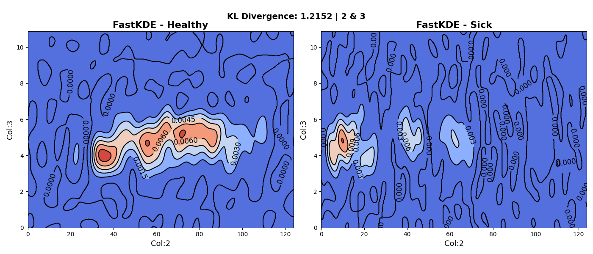
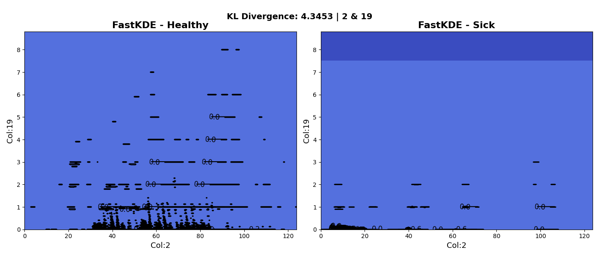
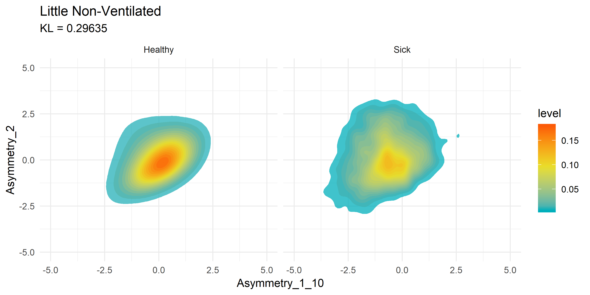
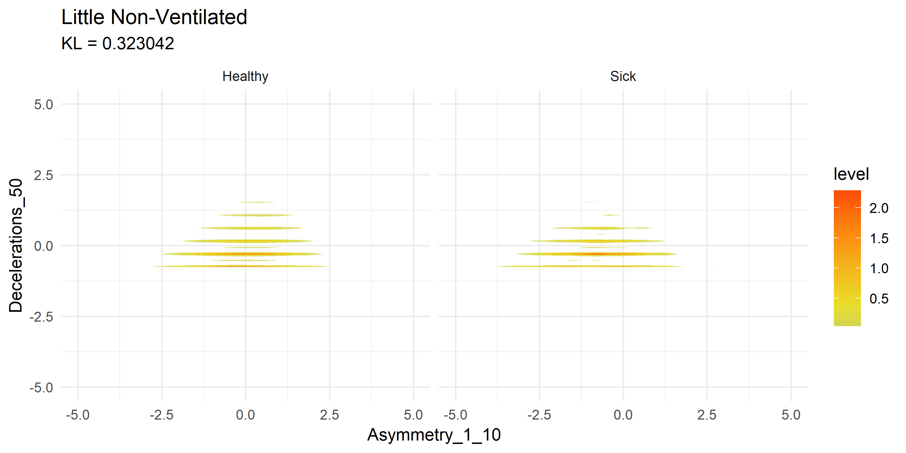

# Heart Rate Variability Research 

Advisee: Ronan Donovan

Advisor: Dr. Daniel Vasiliu

Date: 16 May 2023

Summart Statement: Using Heart rate variability (HRV) and Facebook AI Similarity Search (FAISS) to detect neonatal sepsis. 

# Abstract
__Research Purpose__: Neonatal sepsis is a leading cause of mortality in neonates. The current method of detecting sepsis is through a blood culture, which is invasive and time consuming. Heart rate variability (HRV) is a non-invasive method of detecting sepsis. The goal of this research is to analyze HRV data to improve on existing algorithms like the HeRO score which act as an early warning sign for NICU patients. 

# Summary
__Overview__: This research will use Heart Rate Variability (HRV) sensor data to improve the prediction of sepsis risk in neonates. An SKLearn-compliant estimator will be designed that implements the Facebook AI Similarity Search (FAISS) library to perform ultra-efficient weighted K-Nearest Neighbors (KNN) classification. This will be a versatile python package that can be applied to various domains and will be showcased on GitHub and Python Package Index (PyPI). This development will improve our understanding of how to differentiate between healthy and sick neonates by making the comparison of large quantities of high-dimensional data for classification increasingly trivial. The data from this new estimator will inform HRV-sepsis model development that improves the industry standard Heart Rate Observation (HeRO) score for NICU patients.

# WM-FAISS

The first goal of the research was to build a python package that implements the Facebook AI Similarity Search (FAISS) library to perform ultra-efficient weighted K-Nearest Neighbors (KNN) classification. This package is called WM-FAISS and is available on [PyPI](https://pypi.org/project/wm-faiss/). It can be installed via the command line:

```pip install wm-faiss``` 

The package is on:

| GitHub | Python Package Index |
| --- | --- |
[](https://github.com/RonanChance/wm-faiss) | [](https://pypi.org/project/wm-faiss/)

Currently the package allows the user to create a classifier with the following functions:

- fit()
- predict()
- predict_proba() (In progress..)
- score()
- get_params()
- set_params()

Leveraging the power of FAISS, a quantizer is created to discretize the feature space along with centroids from clustering. This allows for really fast similarity search!

# Kernel Density Estimations with FastKDE

Bivariate Kernel Density Estimation (KDE) is a statistical technique used to estimate the probability density function of a pair of variables. It allows us to visualize the joint distribution of two variables and understand the relationship between them. By smoothing the observed data points in a two-dimensional space, bivariate KDE provides a continuous estimate of the density. This estimation is achieved by placing kernel functions at each data point and summing up their contributions. The resulting KDE plot displays regions of high and low density, allowing us to identify patterns, clusters, and areas of interest in the data. Bivariate KDEs are useful for exploratory data analysis, as they provide a comprehensive and intuitive visualization of the joint distribution, facilitating the identification of relationships and correlations. They are particularly valuable when working with multidimensional data, as they offer a way to understand the interactions between two variables simultaneously.

The reason this is useful is because we need to find two variables that best differentiate between healthy and sick neonates (each variable is a computation relating to heart rate variability). The following two plots showcase some early results of this process. The first plot shows the KDE of variables 2 and 3 whereas the second plot shows the KDE of the 2 and 19.





To get a visual idea of how this compares to past research on the subject matter, we can look at previously generated KDE plots from R code.

***Note these are not the same variables being compared, it is merely an example of how the current Python FastKDE results differ from the R code results.***





Notice how both suffer from stratifying results in the second graphs. This is something I plan to explore further with Zero Inflated Negative Binomial (ZINB) regression, or simply shifting and taking the log of results. 

# Kullback-Leibler Divergence

Kullback-Leibler (KL) Divergence, also known as relative entropy, is a measure of the difference between two probability distributions. It quantifies how one distribution diverges from another in terms of information content. A higher KL Divergence value indicates a greater dissimilarity between the distributions.

There are some of the variables with the highest KL divergence:

| Variable 1 | Variable 2 | KL Divergence |
| --- | --- | --- |
2 | 19 | 4.345
12 | 19 | 4.222
4 | 19 | 4.105
9 | 19 | 4.038
5 | 19 | 4.015
11 | 19 | 4.014
10 | 19 | 4.013

There are some of the variables with lowest KL divergence:

| Variable 1 | Variable 2 | KL Divergence |
| --- | --- | --- |
3 | 6 | 0.062
3 | 32 | 0.058
3 | 4 | 0.057
3 | 5 | 0.057
3 | 7 | 0.055
3 | 28 | 0.055
3 | 27 | 0.050

# Conclusion

The numbers and graphs above are preliminary results and are subject to change as the research progresses. This is just the start, but the initial results look promising for developing an improved detection mechanism for NICU patients. 

# Citations

- <https://engineering.fb.com/2017/03/29/data-infrastructure/faiss-a-library-for-efficient-similarity-search/>
- <https://en.wikipedia.org/wiki/Kernel_density_estimation>
- <https://en.wikipedia.org/wiki/Kullback%E2%80%93Leibler_divergence>
- <https://stats.oarc.ucla.edu/r/dae/zinb/>